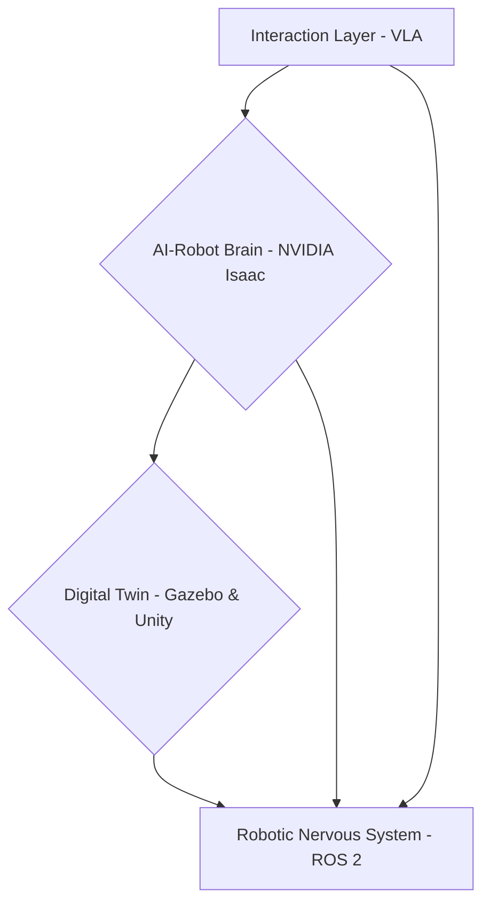

# SpecifyPlus System Architecture

This document provides a detailed look at the architecture of the SpecifyPlus system, breaking down the components and their interactions.

## Core Philosophy

The architecture is designed to be modular and extensible, mirroring the component-based nature of ROS 2. Each layer of the system can be developed, tested, and deployed independently, while communicating with other layers through well-defined ROS 2 interfaces (topics, services, and actions).

## Architectural Layers

### 1. Robotic Nervous System (ROS 2)

This is the central nervous system of the robot.

-   **Nodes, Topics, and Services:** The system is composed of numerous ROS 2 nodes, each responsible for a specific task (e.g., sensor driver, motor controller, planner). These nodes communicate via:
    -   **Topics:** For continuous data streams like camera feeds (`/camera/image_raw`), LiDAR scans (`/scan`), and robot state (`/joint_states`).
    -   **Services:** For request/response interactions, such as triggering a specific action (`/grasp_object`) or retrieving configuration (`/get_parameters`).
-   **rclpy Python Agents:** Custom logic is implemented primarily in Python using the `rclpy` library. These agents subscribe to topics, process data, and publish results, forming the core intelligence of the individual components.
-   **URDF (Unified Robot Description Format):** The physical structure of the humanoid robot is defined in a URDF file. This includes links, joints, and sensor placements, which are used by both simulation and control nodes.

### 2. The Digital Twin (Gazebo & Unity)

This layer provides a virtual environment for the robot to exist in.

-   **Gazebo Physics Simulation:** Gazebo is used to simulate the physics of the robot and its environment. It subscribes to motor commands from the ROS 2 network and publishes sensor data (e.g., IMU, contact sensors) back.
-   **Unity High-Fidelity Rendering:** For photorealistic visuals and advanced sensor simulation (e.g., synthetic camera data for training perception models), the system can interface with Unity. A bridge package syncs the state between the ROS 2 graph and the Unity scene.
-   **Sensor Simulation:** Both Gazebo and Unity are used to simulate sensors like LiDAR, depth cameras, and IMUs. This allows for perception and navigation algorithms to be developed and tested without requiring physical hardware.

### 3. The AI-Robot Brain (NVIDIA Isaac)

This layer handles the heavy computational tasks related to perception and navigation.

-   **Isaac Sim:** For GPU-accelerated simulation, SpecifyPlus can use Isaac Sim. This is particularly useful for training reinforcement learning agents or generating large synthetic datasets.
-   **Isaac ROS:** The system integrates a suite of hardware-accelerated ROS 2 packages from the Isaac ROS collection for common perception tasks like Visual SLAM (VSLAM), depth perception, and AprilTag detection.
-   **Navigation (VSLAM & Nav2):** The output from Isaac ROS perception modules is fed into navigation stacks. VSLAM is used for creating a map of the environment while simultaneously tracking the robot's position. The standard ROS 2 Nav2 stack is adapted for bipedal locomotion, handling path planning and obstacle avoidance.

### 4. Vision-Language-Action (VLA)

This is the highest layer of abstraction, enabling intelligent and autonomous behavior.

-   **Voice Input (OpenAI Whisper):** The system uses Whisper to transcribe spoken commands into text, providing a natural language interface for the user.
-   **LLM Planning:** The transcribed text is sent to a Large Language Model (LLM) which acts as a task planner. The LLM breaks down high-level commands (e.g., "pick up the red block") into a sequence of actions that the robot's control system can execute.
-   **Autonomous Humanoid Control:** This component translates the LLM's plan into concrete ROS 2 service calls and topic publications to execute the desired behavior, integrating perception, navigation, and manipulation.
