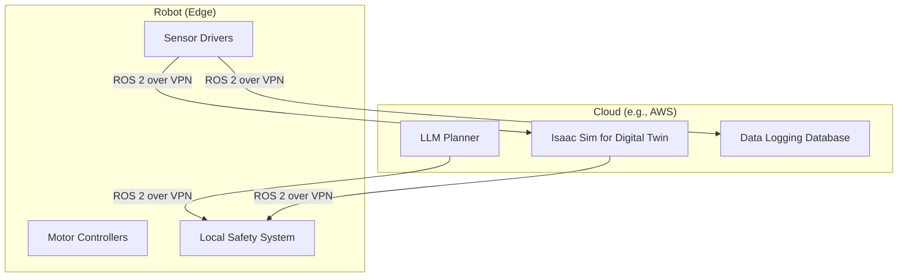

# Deployment: Cloud Deployment

Deploying a full robotics stack like SpecifyPlus in the cloud presents unique challenges, particularly regarding GPU acceleration and real-time communication. This guide outlines strategies and best practices for cloud-based deployment.

## Use Case for Cloud Deployment

-   **Scalable Simulation:** Running thousands of parallel simulations in Isaac Sim for reinforcement learning or synthetic data generation.
-   **CI/CD:** Building and testing ROS 2 code in an automated pipeline.
-   **Remote Development:** Providing a standardized development environment for a distributed team.
-   **Fleet Management:** Connecting a fleet of physical robots to a central cloud backend for monitoring, data logging, and high-level control.

## Strategy 1: Full Stack in a Cloud VM

This approach involves running the entire SpecifyPlus stack (ROS 2, Gazebo/Isaac Sim) on a single, powerful cloud virtual machine.

-   **Provider:** AWS (EC2 G5 instances), GCP (N1 instances with NVIDIA GPUs), or Azure (N-series VMs).
-   **Setup:**
    1.  Provision a VM with a powerful NVIDIA GPU (e.g., A10G, V100).
    2.  Install the NVIDIA drivers, CUDA, and the full local setup (ROS 2, Isaac Sim).
    3.  Use a remote desktop solution like VNC or NICE DCV to get graphical access to the simulator.
-   **Pros:**
    -   Simple to set up, mirrors a local setup.
    -   All communication is local to the VM, minimizing latency.
-   **Cons:**
    -   Can be expensive to keep a powerful GPU instance running.
    -   Not easily scalable.

## Strategy 2: Hybrid Cloud/Edge Model

In this model, the time-sensitive, low-level components run on the physical robot (the "edge"), while the computationally intensive, high-level components run in the cloud.

-   **Communication:** A secure and reliable network connection is critical.
    -   **VPN:** Use a VPN (like WireGuard) to create a single, secure network between the robot and the cloud.
    -   **DDS Router:** Use a DDS router (e.g., eProsima's Fast DDS Router) to bridge the local ROS 2 network on the robot with the ROS 2 network in the cloud. This can be configured to only forward specific topics, saving bandwidth.
-   **Pros:**
    -   Leverages cloud compute for heavy tasks (AI, simulation).
    -   Keeps real-time control loops on the robot for safety and reliability.
-   **Cons:**
    -   Network latency can be a major issue. Careful design is needed to determine which components can tolerate this latency.
    -   More complex to configure and maintain.

## Tools for Cloud Robotics

-   **AWS RoboMaker:** A managed service for running ROS-based simulations and managing robot fleets.
-   **NVIDIA Isaac Platform:** Includes tools for cloud-native simulation and fleet management.
-   **Docker & Kubernetes:** Containerizing your ROS 2 nodes with Docker is essential for portability and scalability. Kubernetes can be used to orchestrate these containers in the cloud, especially for simulation farms.
-   **WebRTC:** For streaming video and other high-bandwidth data from the robot to a browser-based interface, WebRTC is often a better choice than sending raw ROS 2 topics over the internet.
