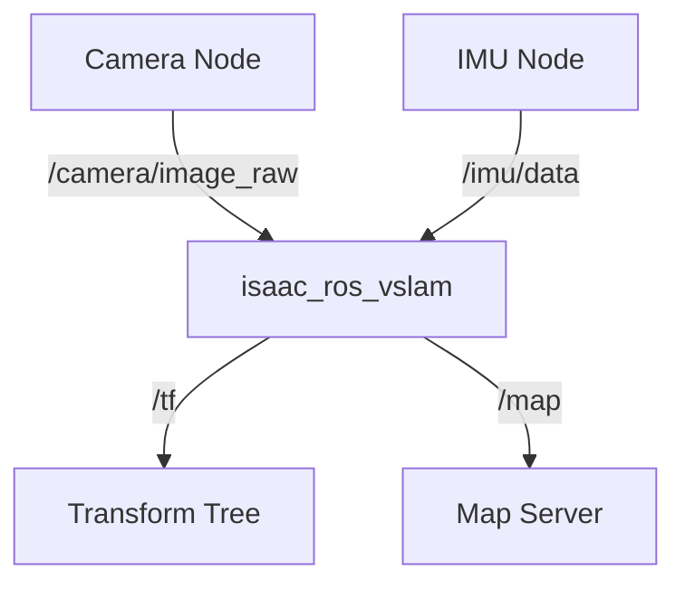

# Module 3: AI Frameworks (NVIDIA Isaac)

This module details the integration of NVIDIA's Isaac SDK for accelerating AI and perception tasks within the SpecifyPlus system. The Isaac ecosystem provides powerful tools for building the "brain" of the robot.

## NVIDIA Isaac Sim

Isaac Sim is a robotics simulation platform built on NVIDIA Omniverse. It offers several advantages that are key to the SpecifyPlus workflow:

-   **Photorealistic Rendering:** High-fidelity, ray-traced rendering is crucial for training and testing vision-based AI models.
-   **GPU-Accelerated Physics:** Isaac Sim leverages the GPU to run physics simulations, enabling large-scale, complex environments and faster-than-real-time simulation.
-   **ROS 2 Integration:** It has built-in support for connecting to the ROS 2 graph, allowing seamless integration with the rest of the SpecifyPlus system. It can subscribe to commands and publish sensor data just like Gazebo.
-   **Synthetic Data Generation:** Provides advanced tools for generating labeled synthetic data for training perception algorithms.

## Isaac ROS

Isaac ROS is a collection of ROS 2 packages that are hardware-accelerated using NVIDIA's GPU technologies (CUDA, TensorRT). SpecifyPlus utilizes these packages to offload heavy computation from the CPU and achieve high performance.

Key Isaac ROS packages used in the system:

-   **`isaac_ros_vslam`:** Provides a high-performance Visual SLAM pipeline that uses the robot's camera and IMU to create a map and track the robot's pose.
-   **`isaac_ros_apriltag`:** For detecting and tracking AprilTags, which are often used for localization or object identification.
-   **`isaac_ros_stereo_image_proc`:** Computes disparity and point clouds from a stereo camera feed, accelerated on the GPU.

**Example: VSLAM Data Flow**

## VSLAM Navigation

Visual Simultaneous Localization and Mapping (VSLAM) is a core capability of the SpecifyPlus system. By using the `isaac_ros_vslam` package, the robot can navigate in unknown environments.

1.  **Input:** The VSLAM node takes in synchronized camera images and IMU data.
2.  **Processing:** It identifies and tracks visual features across image frames. The IMU data helps to predict motion between frames.
3.  **Output:**
    -   It publishes the robot's estimated position and orientation to the ROS 2 transform tree (`/tf`).
    -   It builds and publishes a map of the environment.

This pose information is then used by the navigation stack to plan paths.

## Nav2 for Bipedal Robots

The standard ROS 2 Navigation Stack (Nav2) is used for path planning and obstacle avoidance. While Nav2 is typically used for wheeled robots, it is adapted in SpecifyPlus for bipedal locomotion.

-   **Global Planner:** The global planner in Nav2 (e.g., SmacPlanner) creates a high-level path from the robot's current location to a goal, avoiding obstacles based on the map created by VSLAM.
-   **Local Planner / Controller:** The standard local planners (e.g., DWB, TEB) are replaced with a custom bipedal motion controller. This controller receives the global path and is responsible for executing the walking gait to follow that path, while also handling real-time obstacle avoidance using local sensor data (like LiDAR).
-   **Inputs:** The Nav2 stack takes the map from the VSLAM system and the robot's pose.
-   **Output:** It produces velocity commands (`/cmd_vel`) that are consumed by the bipedal walking controller.
