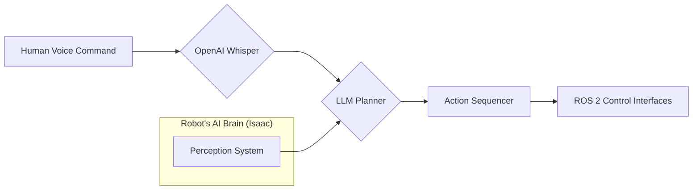

# Module 4: Vision-Language-Action (VLA) Systems

This module describes the highest level of the SpecifyPlus architecture, where Vision, Language, and Action are combined to create intelligent, autonomous behaviors. This layer enables natural and intuitive human-robot interaction.

## System Architecture

The VLA system acts as the primary interface between a human operator and the robot's low-level control and perception systems.



## OpenAI Whisper for Voice

To enable voice-based commands, SpecifyPlus integrates OpenAI's Whisper model.

-   **Function:** Whisper is a state-of-the-art automatic speech recognition (ASR) system. It takes an audio stream from the robot's microphone as input and transcribes it into text.
-   **ROS 2 Node:** A dedicated ROS 2 node runs the Whisper model. It subscribes to an audio topic (e.g., `/audio/mic_in`) and publishes the transcribed text to a string topic (e.g., `/voice_command_text`).

**Example Usage:**

1.  User says: "Robot, please get me the water bottle from the table."
2.  The microphone captures the audio.
3.  The Whisper node transcribes the audio and publishes the string `"Robot, please get me the water bottle from the table."`

## LLM Planning

The text command is then processed by a Large Language Model (LLM) which acts as a high-level task planner.

-   **Input:** The LLM receives the transcribed text command. It can also be provided with additional context from the robot's perception system, such as a list of currently visible objects and their locations.
-   **Function:** The LLM's task is to decompose the high-level, ambiguous human command into a structured plan of concrete, executable actions for the robot. This involves reasoning about the user's intent and the current state of the world.
-   **Output:** The LLM outputs a sequence of actions in a structured format, like JSON.

**Example LLM Interaction:**

-   **Input Command:** "Get me the water bottle from the table."
-   **Perception Context:** `{ "visible_objects": ["water_bottle", "table", "chair"] }`
-   **LLM Output Plan:**
    ```json
    [
      { "action": "navigate_to", "target": "table" },
      { "action": "detect_object", "object_name": "water_bottle" },
      { "action": "grasp_object", "object_name": "water_bottle" },
      { "action": "navigate_to", "target": "user" },
      { "action": "release_object" }
    ]
    ```

## Autonomous Humanoid Capstone

The final step is to translate the LLM's plan into physical actions. This is handled by an "Action Sequencer" or "Behavior Tree" node.

-   **Function:** This node subscribes to the plan from the LLM. It iterates through the sequence of actions and makes the appropriate ROS 2 service calls or topic publications to execute each step.
-   **Integration:** It connects the abstract plan to the underlying robotics modules:
    -   `navigate_to`: Makes a call to the Nav2 action server.
    -   `detect_object`: Uses the perception system (e.g., Isaac ROS) to find the object's precise coordinates.
    -   `grasp_object`: Calls a service on the manipulation node, which controls the robot's arm and gripper.
-   **Feedback:** The action sequencer monitors the success or failure of each action and can report the status back to the LLM, potentially allowing for re-planning if an error occurs.

This capstone integration brings together all the previous modules into a cohesive system that can understand and respond to high-level human commands in the real world.
